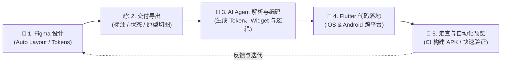

# 从 Figma 设计到 Flutter 代码

> 本文档旨在详细说明如何将 Figma 设计稿、交互原型与设计规范，通过 **AI 编程 Agent（如 Claude code, Codex）** 高保真、高效率地转化为 Flutter 跨平台（iOS & Android）应用源码。

---

## 目录
- [一、 整体协作与转换链路](#一-整体协作与转换链路)
- [二、 Figma 规范化与高效复用](#二-设计师规范指引figma-规范化与高效复用)
  - [1. 布局规范：全面启用 Auto Layout](#1-布局规范全面启用-auto-layout)
  - [2. 设计变量系统（Design Tokens）](#2-设计变量系统design-tokens)
  - [3. 组件化与状态覆盖（Component Variants）](#3-组件化与状态覆盖component-variants)
  - [4. 资产与图标规范（Assets & Icons）](#4-资产与图标规范assets--icons)
  - [5. 跨平台与安全区适配（SafeArea）](#5-跨平台与安全区适配safearea)
  - [6. 高效设计法则：灵活复用成熟素材](#6-高效设计法则灵活复用成熟素材拒绝从零手搓)
- [三、 设计与 Flutter 概念映射对照表](#三-设计与-flutter-概念映射对照表)
- [四、 交付与转换工作流（Hand-off Workflow）](#四-交付与转换工作流hand-off-workflow)
- [五、 本地极速走查：Flutter 热重载（Hot Reload）操作指南](#五-本地极速走查flutter-热重载hot-reload操作指南)
- [六、 需求交付模板与示例（设计师向 Agent / 开发者提报）](#六-需求交付模板与示例设计师向-agent--开发者提报)

---

## 一、 整体协作与转换链路

现代 AI 驱动的开发模式并不需要设计师去学习写 Flutter 代码，但要求**设计稿具备良好的结构化信息**。结构化程度越高，AI Agent 生成的代码越精准、健壮。



---

## 二、 Figma 规范化与高效复用

### 1. 布局规范：全面启用 Auto Layout
AI Agent 生成响应式 Flutter 代码的核心依据是 Figma 的 **Auto Layout**。请尽量避免在画板中随意拖拽坐标进行绝对定位。

- **水平方向排布**：使用 `Auto layout (Horizontal)` ➔ 对应 Flutter `Row`。
- **垂直方向排布**：使用 `Auto layout (Vertical)` ➔ 对应 Flutter `Column`。
- **尺寸约束规则**：
  - **Hug contents**（包裹内容） ➔ 元素根据子项自适应大小。
  - **Fill container**（充满容器） ➔ 对应 Flutter `Expanded` 或宽度 `double.infinity`，实现多屏幕宽度自适应。
  - **Fixed width / height**（固定尺寸） ➔ 对应 Flutter `SizedBox(width, height)`（仅在头像、固定图标等必要场景使用）。
- **间距与内边距（Padding & Gap）**：
  - 统一使用 **4px / 8px 网格系统**（如 `4px`, `8px`, `12px`, `16px`, `24px`, `32px`）。

---

### 2. 设计变量系统（Design Tokens）
将颜色、字体和阴影抽象为 Figma **Variables / Local Styles**，开发 Agent 会直接将其转译为 Flutter 的 `AppColors` 和 `ThemeData`。

* **色彩命名规范**：
  - `Primary / Default`（主品牌色）
  - `Secondary / ...`（辅助色）
  - `Neutral / 900, 800...`（中性文字与背景色）
  - `Feedback / Success, Warning, Error, Info`（状态反馈色）
* **字体规范（Typography）**：
  - 明确标题级别：`Display`, `Heading 1-3`, `Body Large/Medium/Small`, `Caption`。
  - 标明行高（Line Height）与字重（Regular 400, Medium 500, SemiBold 600, Bold 700）。
* **圆角与阴影**：
  - 圆角变量：`Radius/sm (4px)`, `Radius/md (8px)`, `Radius/lg (16px)`, `Radius/full (999px)`。

---

### 3. 组件化与状态覆盖（Component Variants）
为了让生成的 APP 具备流畅完整的交互体验，一个组件通常需要提供其完整的**变体状态（Variants）**：

- **基础交互状态**：
  - `Default`（默认态）
  - `Hover / Pressed`（按下/按住态）
  - `Disabled`（禁用态）
  - `Loading`（加载态，如按钮转圈或骨架屏）
- **数据分支状态**：
  - 页面/模块的 **正常加载**、**空数据状态 (Empty State)**、**网络错误/异常状态 (Error State)**。

---

### 4. 资产与图标规范（Assets & Icons）
- **图标（Icons）**：
  - 优先以 **SVG 格式** 交付，确保图标内部路径已转曲（Outline Stroke）。
  - 图标需包含透明占位框（如统一为 `24x24px` 或 `32x32px` 容器），便于对齐。
- **位图图片（Images/Illustrations）**：
  - 提供 `@2x` 与 `@3x` 清晰度的 PNG / WebP 导出。
  - 命名统一采用小写下划线命名法（如 `img_empty_box.png`、`ic_pill_reminder.svg`）。

---

### 5. 跨平台与安全区适配（SafeArea）
Flutter 同时运行于 iOS 与 Android：
- **顶部安全区**：设计稿需预留出 iPhone 灵动岛 / 刘海 / 状态栏高度（约 `44px ~ 59px`），设计时使用常规安全边距即可，开发时会自动包裹 `SafeArea`。
- **底部手势条**：屏幕底部需预留 Home Indicator 区域（约 `34px`）。
- **可点击热区**：按钮和图标的可点击范围最小不应低于 `44x44px`（符合 iOS HIG / Material Design 规范）。

---

### 6. 复用成熟素材

> **核心原则**：**没有必要所有的设计素材都自己从零绘制！**
> 在现代移动端 App 开发中，**80% 的通用组件（基础按钮、开关、输入框、通用图标、微动效）应直接复用开源生态资源**，设计师应将精力集中在 20% 属于 Pillxa 智能药盒的核心业务体验（药仓网格、打卡逻辑、硬件配对）上。

#### ① Figma 社区现成 Kit
- **Google 官方 `Material 3 Design Kit`**：
  - 在 Figma 社区搜索并复制。包含实心按钮、描边按钮、文字按钮、卡片、开关、时间/日期选择器等。
  - **优势**：与 Flutter 内置的 Material 3 组件库 **100% 像素级对齐**，代码端无需任何自定义即可直接调用。
- **Apple 官方 `iOS 17 & iPadOS 17 Figma Library`**：
  - 用于对齐 iOS 原生顶部状态栏、底部手势条、Cupertino 风格弹窗。
- **医疗健康类社区模板**：
  - 在 Figma 社区搜索 `Medication Tracker`、`Pill Reminder UI Kit` 或 `Health Dashboard`，有大量成熟的服药时间轴、胶囊/药丸样式、每日打卡卡片可直接借鉴参考。

#### ② 推荐 Figma 插件
- **矢量图标库：`Lucide Icons` / `Iconify` 插件**：
  - 包含上万个免费开源矢量图标（药丸 💊、闹钟 ⏰、蓝牙 📶、设置 ⚙️）。
  - **代码直通**：图标名称与 Flutter 的 `lucide_icons` 代码库完全一致，设计师只需在画板标注图标名，开发**无需切图，一行代码直接调用**。
- **打卡与状态微动效：`LottieFiles for Figma` 插件**：
  - 搜索免费的“服药打卡成功”、“正在同步药盒”、“空数据插画”等 Lottie 动效。
  - 一键导出 `.json` 文件交付开发，Flutter 原生 60 帧丝滑播放。
- **主题色生成：`Material Theme Builder` 插件**：
  - 选定一个品牌主色，插件自动生成整套 Light / Dark 双模式无障碍对比度色阶，并可直接导出为代码 Tokens。

---

## 三、 设计与 Flutter 概念映射对照表

设计师在 Figma 中的每一个设置，在 Flutter 中都有精准的代码映射：

| Figma 设计概念 | Auto Layout / 属性 | Flutter 对应组件 / 代码 | 建议与注意事项 |
| :--- | :--- | :--- | :--- |
| **水平排布** | Auto Layout (Horizontal) | `Row` / `Wrap` | 设置对齐方式（MainAxisAlignment） |
| **垂直排布** | Auto Layout (Vertical) | `Column` | 设置间距（spacing / SizedBox） |
| **层叠覆盖** | Frame without Auto Layout | `Stack` + `Positioned` | 仅在浮动徽章、背景层叠时使用 |
| **自适应拉伸** | Width/Height: `Fill container` | `Expanded(child: ...)` | 保证不同屏幕宽度下不会溢出 |
| **自适应包裹** | Width/Height: `Hug contents` | `IntrinsicWidth` / 默认行为 | 随文本内容自动变宽/高 |
| **外边距/内边距** | Padding (Top, Right, Bottom, Left) | `Padding(EdgeInsets.all/symmetric)` | 建议保持 4/8 整数倍 |
| **背景色与边框** | Fill & Stroke & Corner Radius | `BoxDecoration(color, border, borderRadius)` | 使用统一的 Radius Token |
| **阴影** | Drop Shadow / Layer Blur | `BoxShadow(...)` | 避免使用多重过重模糊 |
| **图标导出** | Export SVG | `SvgPicture.asset(...)` | 统一 24/32px 画布尺寸 |
| **多行文字滚动** | 页面高度超出 Frame 边界 | `SingleChildScrollView` / `ListView` | 需标明可滚动区域与吸顶区域 |

---

## 四、 交付与转换工作流（Hand-off Workflow）

```
[步骤 1: 设计定稿]
  └── 设计师完成 Figma 设计稿（Auto Layout 完备，附带交互说明与状态变体）
        │
[步骤 2: 交付发起]
  └── 设计师提供 Figma MCP、切图标注，或直接提供界面规范截图
        │
[步骤 3: Agent 自动化编码]
  └── 编程 Agent 读取设计结构，分层生成：
       ├── ① 主题样式与色彩（AppColors / ThemeData）
       ├── ② 独立可复用组件（Custom Widgets）
       ├── ③ 完整页面视图（Screens）与动态交互
       └── ④ 状态逻辑绑定（State / Service）
        │
[步骤 4: 编译与质量检查]
  └── 运行本地测试（flutter test）与 CI 自动化构建
        │
[步骤 5: 预览与走查反馈]
  └── 自动输出预览 APK / 测试包，或通过本地热重载进行即时走查
```

---

## 五、 Flutter 热重载（Hot Reload）操作指南

在微调 UI 颜色、字号、间距或布局时，**无需重新打包等待**，利用 Flutter 的**热重载（Hot Reload）**可以在 **0.5 秒内** 实时更新屏幕界面，且**保留当前页面与操作状态**。

### VS Code 操作

1. **第一步：打开项目目录**
   - 使用 **VS Code** 打开本项目目库，并安装好Flutter插件。

2. **第二步：选择运行环境**
   - 点击 VS Code 窗口**右下角状态栏**的设备名称，选择运行目标：
     - **(a) 安卓真机**：插上自己已开启“开发者模式 / USB 调试”的安卓手机（触摸与真机手感最真实）。
     - **(b) 安卓虚拟机**：接入电脑上启动的 Android Studio 模拟器（方便大屏截屏走查）。
     - **(c) Web 浏览器**：选择 Chrome/Edge 运行（方便直接拉伸窗口宽度，验证响应式适配）。

3. **第三步：一键启动调试**
   - 按键盘上的 **`F5`**（部分笔记本需按 **`Fn + F5`**）。
   - 稍等片刻，App 会自动在选定设备/浏览器中启动运行。

4. **第四步：边调边看**
   - 当你在代码中微调了文字、颜色或布局样式后：
     - **点击按钮**：点击 VS Code 顶部悬浮调试条中的 **黄色闪电图标 ⚡（Hot Reload）**；
     - **或直接保存**：直接按 **`Ctrl + S`**（Mac 为 `Cmd + S`）保存文件，界面即可瞬间毫秒级刷新！

---

## 六、 需求交付模板与示例

当完成某个模块设计并希望交付给 Agent 转码时，可以使用以下标准格式提报：

### 📝 交付提报模板

```markdown
### 模块交付：【页面/组件名称】

1. 设计稿资源：
   - Figma 链接 / Frame 名称：[粘贴链接或说明]
   - 参考截图：[附加设计稿清晰截图]

2. 核心元素与结构：
   - 顶部导航：[标题名称、是否有返回按钮/右侧操作按钮]
   - 核心组件：[如：用药打卡卡片、倒计时进度圈、药品列表项]
   - 底部操作区：[如：固定底部的“确认服药”大按钮]

3. 状态与交互流转说明：
   - 默认状态：[展示当前服药计划与倒计时]
   - 点击卡片：[弹出用药详情 BottomSheet 弹窗]
   - 点击确认按钮：[按钮变为 Loading 态，成功后卡片变为“已服药”绿色状态]
   - 空数据状态：[若今日无用药计划，展示插画与“暂无安排”提示语]

4. 关键尺寸与动效要求：
   - 页面背景色：#F8FAFC
   - 卡片圆角：16px
   - 卡片间距：12px
   - 进场动效：页面元素淡入上浮（Fade & Slide, 300ms）
```

---


